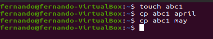
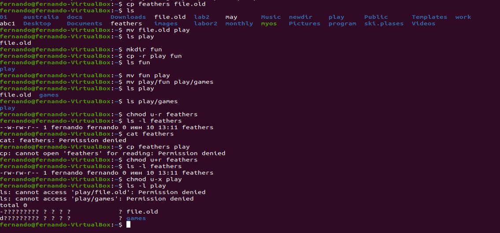
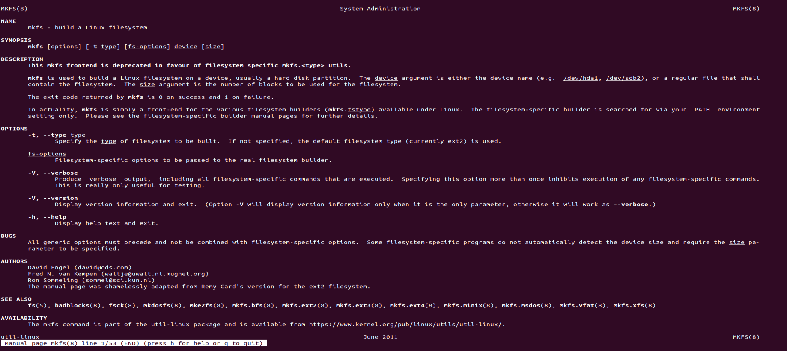

---
# Front matter
lang: ru-RU
title: "Шаблон отчёта по лабораторной работе 2"
subtitle: "дисциплина: Операционные системы"
author: "Студент: Леон Атупанья Хосе Фернандо"

# Formatting
toc-title: "Содержание"
toc: true # Table of contents
toc_depth: 2
lof: true # List of figures
lot: true # List of tables
fontsize: 12pt
linestretch: 1.5
papersize: a4paper
documentclass: scrreprt
polyglossia-lang: russian
polyglossia-otherlangs: english
mainfont: PT Serif
romanfont: PT Serif
sansfont: PT Sans
monofont: PT Mono
mainfontoptions: Ligatures=TeX
romanfontoptions: Ligatures=TeX
sansfontoptions: Ligatures=TeX,Scale=MatchLowercase
monofontoptions: Scale=MatchLowercase
indent: true
pdf-engine: lualatex
header-includes:
  - \linepenalty=10 # the penalty added to the badness of each line within a paragraph (no associated penalty node) Increasing the value makes tex try to have fewer lines in the paragraph.
  - \interlinepenalty=0 # value of the penalty (node) added after each line of a paragraph.
  - \hyphenpenalty=50 # the penalty for line breaking at an automatically inserted hyphen
  - \exhyphenpenalty=50 # the penalty for line breaking at an explicit hyphen
  - \binoppenalty=700 # the penalty for breaking a line at a binary operator
  - \relpenalty=500 # the penalty for breaking a line at a relation
  - \clubpenalty=150 # extra penalty for breaking after first line of a paragraph
  - \widowpenalty=150 # extra penalty for breaking before last line of a paragraph
  - \displaywidowpenalty=50 # extra penalty for breaking before last line before a display math
  - \brokenpenalty=100 # extra penalty for page breaking after a hyphenated line
  - \predisplaypenalty=10000 # penalty for breaking before a display
  - \postdisplaypenalty=0 # penalty for breaking after a display
  - \floatingpenalty = 20000 # penalty for splitting an insertion (can only be split footnote in standard LaTeX)
  - \raggedbottom # or \flushbottom
  - \usepackage{float} # keep figures where there are in the text
  - \floatplacement{figure}{H} # keep figures where there are in the text
---

# Цель работы

Познакомьтесь с файловой системой Linux, ее структурой, именами и содержимым каталогов. Получить практические знания о применении команд, проверки использования диска и обслуживания файловой системы.

# Задание

1. Выполните все примеры, приведённые в первой части описания лабораторной
работы.
2. Выполните следующие действия, зафиксировав в отчёте по лабораторной работе
используемые при этом команды и результаты их выполнения:
2.1. Скопируйте файл /usr/include/sys/io.h в домашний каталог и назовите
его equipment. Если файла io.h нет, то используйте любой другой файл в
каталоге /usr/include/sys/ вместо него.
2.2. В домашнем каталоге создайте директорию ~/ski.plases.
2.3. Переместите файл equipment в каталог ~/ski.plases.
2.4. Переименуйте файл ~/ski.plases/equipment в
~/ski.plases/equiplist.
2.5. Создайте в домашнем каталоге файл abc1 и скопируйте его в каталог
~/ski.plases, назовите его equiplist2.
2.6. Создайте каталог с именем equipment в каталоге ~/ski.plases.
2.7. Переместите файлы ~/ski.plases/equiplist и equiplist2 в каталог
~/ski.plases/equipment.
2.8. Создайте и переместите каталог ~/newdir в каталог ~/ski.plases и назовите его plans.
3. Определите опции команды chmod, необходимые для того, чтобы присвоить перечисленным ниже файлам выделенные права доступа, считая, что в начале таких прав нет:
3.1. drwxr--r-- ... australia
3.2. drwx--x--x ... play   
3.3. -r-xr--r-- ... my_os
3.4. -rw-rw-r-- ... feathers
При необходимости создайте нужные файлы.
4. Проделайте приведённые ниже упражнения, записывая в отчёт по лабораторной
работе используемые при этом команды:
4.1. Просмотрите содержимое файла /etc/password.
4.2. Скопируйте файл ~/feathers в файл ~/file.old.
4.3. Переместите файл ~/file.old в каталог ~/play.
4.4. Скопируйте каталог ~/play в каталог ~/fun.
4.5. Переместите каталог ~/fun в каталог ~/play и назовите его games.
4.6. Лишите владельца файла ~/feathers права на чтение.
4.7. Что произойдёт, если вы попытаетесь просмотреть файл ~/feathers командой cat?
4.8. Что произойдёт, если вы попытаетесь скопировать файл ~/feathers?
4.9. Дайте владельцу файла ~/feathers право на чтение.
4.10. Лишите владельца каталога ~/play права на выполнение.
4.11. Перейдите в каталог ~/play. Что произошло?
4.12. Дайте владельцу каталога ~/play право на выполнение.
5. Прочитайте man по командам mount, fsck, mkfs, kill и кратко их охарактеризуйте, приведя примеры

# Выполнение лабораторной работы

 1. Дклаем все примеры, которые написано на файл. 
 1.1 Копирование файла в текущем каталоге. Скопировать файл ~/abc1 в файл april и в файл may (рис. -@fig:001):
 
 { #fig:001 width=70%}
 
 1.2 Копирование нескольких файлов в каталог. Скопировать файлы april и may в каталог monthly (рис. -@fig:002):
 
  { #fig:002 width=70%}
  
 1.3 Копирование файлов в произвольном каталоге. Скопировать файл monthly/may в файл с именем june (рис. -@fig:003):

{ #fig:003 width=70% }
 
 1.4 Копирование каталогов в текущем каталоге. Скопировать каталог monthly в каталог monthly.00. (рис. -@fig:004):
 1.5 Копирование каталогов в произвольном каталоге. Скопировать каталог monthly.00 в каталог /tmp. (рис. -@fig:004):
 
 { #fig:004 width=70% }
 
 1.5 Переименование файлов в текущем каталоге. Изменить название файла april на july в домашнем каталоге (рис. -@fig:005):
 
  { #fig:005width=70% }

1.6 (рис. -@fig:006)
- Перемещение файлов в другой каталог. Переместить файл july в каталог monthly.00
- Перемещение файлов в другой каталог. Переместить файл july в каталог monthly.00
- Переименование каталогов в текущем каталоге. Переименовать каталог monthly.00 в monthly.01
- Перемещение каталога в другой каталог. Переместить каталог monthly.01 в каталог reports:
- Переименование каталога, не являющегося текущим. Переименовать каталог reports/monthly.01 в reports/monthly:

  { #fig:006width=70% }
  
  1.7 (рис. -@fig:007)
  - Для файла (крайнее левое поле имеет значение -) владелец файла имеет право на чтение и запись (rw-), группа, в которую входит владелец файла, может читать файл (r--), все остальные могут читать файл (r--)
  - Только владелец файла имеет право на чтение, изменение и выполнение файла
  - Владелец каталога (крайнее левое поле имеет значение d) имеет право на просмотр, изменение и доступа в каталог, члены группы могут входить и просматривать его, все остальные — только входить в каталог
  - Требуется создать файл ~/may с правом выполнения для владельца
  - Требуется лишить владельца файла ~/may права на выполнение
  - Требуется создать каталог monthly с запретом на чтение для членов группы и всех остальных пользователей
  - Требуется создать файл ~/abc1 с правом записи для членов группы

  { #fig:007width=70% }
  
 2. Выполняем следующие действия. (рис. -@fig:008) (рис. -@fig:009).
 
 - Скопировать файл /usr/include/sys/io.h в домашний каталог и назовите его equipment.
 - В домашнем каталоге создаем директорию ~/ski.plases (команда «mkdir ski.plases»).
 - Перемещаем файл equipment в каталог ~/ski.plases (команда «mv equipment ski.plases»).
 - Переименовываем файл ~/ski.plases/equipment в ~/ski.plases/equiplist (команда «mv ski.plases/equipment ski.plases/equiplist»).
 - Создаем в домашнем каталоге файл abc1 (команда «touch abc1») и копируем его в каталог ~/ski.plases (команда «cp abc1 ski.plases»), называем его equiplist2 (команда «mv ski.plases/abc1 ski.plases/equiplist2»).
 - Создаем каталог с именем equipment в каталоге ~/ski.plases (команда «mkdir ski.plases/equipment»).
 - Перемещаем файлы ~/ski.plases/equiplist и equiplist2 в каталог ~/ski.plases/equipment (команда «mv ski.plases/equiolist ski.plases/equiplist2 ski.plases/equipment»).
 -  Создаем (команда «mkdir newdir») и перемещаем каталог ~/newdir в каталог ~/ski.plases (команда «mv newdir ski.plases») и называем его plans (команда «mv ski.plases/newdir ski.plases/plans»).
 
 { #fig:008width=70% }
  { #fig:009width=70% }
  
  3. Определите опции команды chmod, необходимые для того, чтобы присвоить перечисленным ниже файлам выделенные права доступа, считая, что в начале таких прав нет (рис. -@fig:0010):
 - drwxr--r-- ... australia: команда «chmod 744 australia» (это каталог, владелец имеет право на чтение, запись и выполнение, группа владельца и остальные – только чтение)
 - drwx--x--x ... play: команда «chmod 711 play» (это каталог, владелец имеет право на чтение, запись и выполнение, группа владельца и остальные – только выполнение)
 - -r-xr--r-- ... my_os: команда «chmod 544 my_os» (это файл, владелец имеет право на чтение и выполнение, группа владельца и остальные – только чтение)
 - -rw-rw-r-- ... feathers: команда «chmod 664 feathers» (это файл,владелец и группа владельца имеют право на чтение и запись, остальные – только чтение) Командой «ls -l» проверяем правильность выполненных действий
 
 { #fig:0010width=70% }
 
 4. Выполняем следующие упражнения (рис. -@fig:0011), (рис. -@fig:0012), (рис. -@fig:0013).
 - Просмотрите содержимое файла /etc/password.
 -  Скопируйте файл ~/feathers в файл ~/file.old. 
 -   Переместите файл ~/file.old в каталог ~/play. 
 -  Скопируйте каталог ~/play в каталог ~/fun. 
 -  Переместите каталог ~/fun в каталог ~/play и назовите его games.
 -  Лишите владельца файла ~/feathers права на чтение.
 -  Что произойдёт, если вы попытаетесь просмотреть файл ~/feathers командой cat? 
 -  Что произойдёт, если вы попытаетесь скопировать файл ~/feathers? 
 -  Дайте владельцу файла ~/feathers право на чтение.
 -  Лишите владельца каталога ~/play права на выполнение. 
 -  Перейдите в каталог ~/play. Что произошло? 
 -  Дайте владельцу каталога ~/play право на выполнение
 
  { #fig:0011width=70% }
  { #fig:0012width=70% }
  { #fig:0013width=70% }
  
 5. Мы читаем о командах man mount, fsck, mkfs, kill и описываем их.
 
 man mount - Предназначена для монтирования файловой системы. Все файлы, доступные в Unix системах, составляют иерархическую файловую структуру, которая имеет ветки (каталоги) и листья (файлы в каталогах). Корень этого дерева обозначается как /. Физически файлы могут располагаться на различных устройствах. Команда mount служит для подключения файловых систем разных устройств к этому большому дереву.
Наиболее часто встречающаяся форма команды mount выглядит следующим образом:
«mount -t vfstype device dir»
Такая команда предлагает ядру смонтировать (подключить) файловую систему указанного типа vfstype, расположенную на устройстве device, к заданному каталогу dir, который часто называют точкой монтирования. (рис. -@fig:0014)
 
 { #fig:0014width=70% }
  
  man fsck - Это утилита командной строки, которая позволяет выполнять проверки согласованности и интерактивное исправление в одной или нескольких файловых системах Linux. Он использует программы, специфичные для типа файловой системы, которую он проверяет.
У команды fsck следующий синтаксис:
fsck параметр -- параметры ФС <файловая система> . . .
Например, если нужно восстановить («починить») файловую систему на некотором устройстве /dev/sdb2, следует воспользоваться командой:
«sudo fsck -y /dev/sdb2»
Опция -y необходима, т. к. при её отсутствии придётся слишком часто давать подтверждение. (рис. -@fig:0015)

 { #fig:0015width=70% }
 
 man mkfs - Создаёт новую файловую систему Linux.
Имеет следующий синтаксис:
mkfs -V -t fstype fs-options filesys blocks
mkfs используется для создания файловой системы Linux на некотором устройстве, обычно в разделе жёсткого диска. В качестве аргумента filesys для файловой системы может выступать или название устройства (например, /dev/hda1, /dev/sdb2) или точка монтирования (например, /, /usr, /home).
Аргументом blocks указывается количество блоков, которые выделяются для использования этой файловой системой.
По окончании работы mkfs возвращает 0 - в случае успеха, а 1 - при неудачной операции.
Например, команда «mkfs -t ext2 /dev/hdb1» создаёт файловую систему типа ext2 в разделе /dev/hdb1 (второй жёсткий диск). (рис. -@fig:0016)

{ #fig:0016width=70% }

man kill - Посылает сигнал процессу или выводит список допустимых сигналов.
Имеет следующий синтаксис:
kill опции PID, где PID – это PID (числовой идентификатор) процесса или несколько PID процессов, если требуется послать сигнал сразу нескольким процессам.
Например, команда «kill -KILL 3121» посылает сигнал KILL процессу с PID 3121, чтобы принудительно завершить процесс. (рис. -@fig:0017)

{ #fig:0016width=70% }

# контрольные вопросы
1.  Чтобы узнать, какие файловые системы существуют на жёстком диске моего компьютера, использую команду «df -Th». На моем компьютере есть следующие файловые системы: devtmpfs, tmpfs, ext4, iso9660. devtmpfs позволяет ядру создать экземпляр tmpfs с именем devtmpfs при инициализации ядра, прежде чем регистрируется какое-либо устройство с драйверами. Каждое устройство с майором / минором будет предоставлять узел устройства в devtmpfs. devtmpfs монтируется на /dev и содержит специальные файлы устройств для всех устройств. tmpfs − временное файловое хранилище во многих Unix-подобных ОС. Предназначена для монтирования файловой системы, но размещается в ОЗУ вместо ПЗУ. Подобная конструкция является RAM диском. Данная файловая система также предназначенная для быстрого и ненадёжного хранения временных данных. Хорошо подходит для /tmp и массовой сборки пакетов/образов. Предполагает наличие достаточного объёма виртуальной памяти. Файловая система tmpfs предназначена для того, чтобы использовать часть физической памяти сервера как обычный дисковый раздел, в котором можно сохранять данные (чтение и запись). Поскольку данные размещены в памяти, то чтение или запись происходят во много раз быстрее, чем с обычного HDD диска. ext4 − имеет обратную совместимость с предыдущими версиями ФС. Эта версия была выпущена в 2008 году. Является первой ФС из «семейства» Ext, использующая механизм «extent file system», который позволяет добиться меньшей фрагментации файлов и увеличить общую производительность файловой системы. Кроме того, в Ext4 реализован механизм отложенной записи (delayed allocation − delalloc), который так же уменьшает фрагментацию диска и снижает нагрузку на CPU. С другой стороны, хотя механизм отложенной записи и используется во многих ФС, но в силу сложности своей реализации он повышает вероятность утери данных.  
    Характеристики:

-   максимальный размер файла: 16 TB;
-   максимальный размер раздела: 16 TB;
-   максимальный размер имени файла: 255 символов.  
    Рекомендации по использованию:
-   наилучший выбор для SSD;
-   наилучшая производительность по сравнению с предыдущими Etx-системами;
-   она так же отлично подходит в качестве файловой системы для серверов баз данных, хотя сама система и моложе Ext3.  
    ISO 9660 − стандарт, выпущенный Международной организацией по стандартизации, описывающий файловую систему для дисков CD-ROM. Также известен как CDFS (Compact Disc File System). Целью стандарта является обеспечить совместимость носителей под разными операционными системами, такими, как Unix, Mac OS, Windows.
	
	2. Файловая система Linux/UNIX физически представляет собой пространство раздела диска разбитое на блоки фиксированного размера, кратные размеру сектора − 1024, 2048, 4096 или 8120 байт. Размер блока указывается при создании файловой системы. В файловой структуре Linux имеется один корневой раздел − / (он же root, корень). Все разделы жесткого диска (если их несколько) представляют собой структуру подкаталогов, "примонтированных" к определенным каталогам.

-   / − корень  
    Это главный каталог в системе Linux. По сути, это и есть файловая система Linux. Адреса всех файлов начинаются с корня, а дополнительные разделы, флешки или оптические диски подключаются в папки корневого каталога.Только пользователь root имеет право читать и изменять файлы в этом каталоге.
-   /BIN – бинарные файлы пользователя  
    Этот каталог содержит исполняемые файлы. Здесь расположены программы, которые можно использовать в однопользовательском режиме или режиме восстановления.
-   /SBIN – системные испольняемые файлы  
    Так же как и /bin, содержит двоичные исполняемые файлы, которые доступны на ранних этапах загрузки, когда не примонтирован каталог /usr. Но здесь находятся программы, которые можно выполнять только с правами суперпользователя.
-   /ETC – конфигурационные файлы  
    В этой папке содержатся конфигурационные файлы всех программ, установленных в системе. Кроме конфигурационных файлов, в системе инициализации Init Scripts, здесь находятся скрипты запуска и завершения системных демонов, монтирования файловых систем и автозагрузки программ.
-   /DEV – файлы устройств  
    В Linux все, в том числе внешние устройства являются файлами. Таким образом, все подключенные флешки, клавиатуры, микрофоны, камеры − это просто файлы в каталоге /dev/. Выполняется сканирование всех подключенных устройств и создание для них специальных файлов.
-   /PROC – информация о процессах  
    По сути, это псевдофайловая система, содержащая подробную информацию о каждом процессе, его Pid, имя исполняемого файла, параметры запуска, доступ к оперативной памяти и так далее. Также здесь можно найти информацию об использовании системных ресурсов.
-   /VAR – переменные файлы  
    Название каталога /var говорит само за себя, он должен содержать файлы, которые часто изменяются. Размер этих файлов постоянно увеличивается. Здесь содержатся файлы системных журналов, различные кеши, базы данных и так далее.
-   /TMP – временные файлы  
    В этом каталоге содержатся временные файлы, созданные системой, любыми программами или пользователями. Все пользователи имеют право записи в эту директорию.
-   /USR – программы пользователя  
    Это самый большой каталог с большим количеством функций. Здесь находятся исполняемые файлы, исходники программ, различные ресурсы приложений, картинки, музыку и документацию.
-   /HOME – домашняя папка  
    В этой папке хранятся домашние каталоги всех пользователей. В них они могут хранить свои личные файлы, настройки программ и т.д.
-   /BOOT – файлы загрузчика  
    Содержит все файлы, связанные с загрузчиком системы. Это ядро vmlinuz, образ initrd, а также файлы загрузчика, находящие в каталоге /boot/grub.
-   /LIB – системные библиотеки  
    Содержит файлы системных библиотек, которые используются исполняемыми файлами в каталогах /bin и /sbin.
-   /OPT – дополнительные программы  
    В эту папку устанавливаются проприетарные программы, игры или драйвера. Это программы созданные в виде отдельных исполняемых файлов самими производителями.
-   /MNT – монтирование  
    В этот каталог системные администраторы могут монтировать внешние или дополнительные файловые системы.
-   /MEDIA – съемные носители  
    В этот каталог система монтирует все подключаемые внешние накопители –USB флешки, оптические диски и другие носители информации.
-   /SRV – сервер В этом каталоге содержатся файлы серверов и сервисов.
-   /RUN - процессы Каталог, содержащий PID файлы процессов, похожий на /var/run, но в отличие от него, он размещен в TMPFS, а поэтому после перезагрузки все файлы теряются.

 3. Чтобы содержимое некоторой файловой системы было доступно операционной системе необходимо воспользоваться командой mount.
 
 4.  Целостность файловой системы может быть нарушена из-за перебоев в питании, неполадок в оборудовании или из-за некорректного/внезапного выключения компьютера. Чтобы устранить повреждения файловой системы необходимо использовать команду fsck.

 5.  Файловую систему можно создать, используя команду mkfs. Ее краткое описание дано в пункте 5 в ходе выполнения заданий лабораторной работы.
 
 6.  Для просмотра текстовых файлов существуют следующие команды:

-   сat  
    Задача команды cat очень проста − она читает данные из файла или стандартного ввода и выводит их на экран.  
    Синтаксис утилиты:  
    cat опции файл1 файл2 ...  
    Основные опции:  
    \-b – нумеровать только непустые строки  
    \-E – показывать символ $ в конце каждой строки  
    \-n – нумеровать все строки  
    \-s – удалять пустые повторяющиеся строки-T – отображать табуляции в виде ^I  
    \-h – отобразить справку  
    \-v – версия утилиты
-   nl  
    Команда nl действует аналогично команде cat, но выводит еще и номера строк в столбце слева.
-   less  
    Cущественно более развитая команда для пролистывания текста.  
    При чтении данных со стандартного ввода она создает буфер, который позволяет листать текст как вперед, так и назад, а также искать как по направлению к концу, так и по направлению к началу текста.  
    Синтаксис аналогичный синтаксису команды cat.  
    Некоторые опции:  
    \-g – при поиске подсвечивать только текущее найденное слово (по умолчанию подсвечиваются все вхождения)  
    \-N – показывать номера строк
-   head  
    Команда head выводит начальные строки (по умолчанию − 10) из одного или нескольких документов. Также она может показывать данные, которые передает на вывод другая утилита.  
    Синтаксис аналогичный синтаксису команды cat.  
    Основные опции:  
    \-c (--bytes) − позволяет задавать количество текста не в строках, а в байтах  
    \-n (--lines) − показывает заданное количество строк вместо 10, которые выводятся по умолчанию  
    \-q (--quiet, --silent) − выводит только текст, не добавляя к нему название файла  
    \-v (--verbose) − перед текстом выводит название файла-z (--zero-terminated) − символы перехода на новую строку заменяет символами завершения строк
-   tail  
    Эта команда позволяет выводить заданное количество строк с конца файла, а также выводить новые строки в интерактивном режиме.  
    Синтаксис аналогичный синтаксису команды cat.  
    Основные опции:  
    \-c − выводить указанное количество байт с конца файла  
    \-f − обновлять информацию по мере появления новых строк в файле  
    \-n − выводить указанное количество строк из конца файла  
    \--pid − используется с опцией -f, позволяет завершить работу утилиты, когда завершится указанный процесс  
    \-q − не выводить имена файлов  
    \--retry − повторять попытки открыть файл, если он недоступен  
    \-v − выводить подробную информацию о файле
	
7.  Утилита cp позволяет полностью копировать файлы и директории.  
    Cинтаксис:  
    cp опции файл-источник файл-приемник  
    После выполнения команды файл-источник будет полностью перенесен в файл-приемник. Если в конце указан слэш, файл будет записан в заданную директорию с оригинальным именем.  
    Основные опции:  
    \--attributes-only − не копировать содержимое файла, а только флаги доступа и владельца  
    \-f, --force − перезаписывать существующие файлы  
    \-i, --interactive − спрашивать, нужно ли перезаписывать существующие файлы  
    \-L − копировать не символические ссылки, а то, на что они указывают-n − не перезаписывать существующие файлы  
    \-P − не следовать символическим ссылкам  
    \-r − копировать папку Linux рекурсивно  
    \-s − не выполнять копирование файлов в Linux, а создавать символические ссылки  
    \-u − скопировать файл, только если он был изменён  
    \-x − не выходить за пределы этой файловой системы  
    \-p − сохранять владельца, временные метки и флаги доступа при копировании  
    \-t − считать файл-приемник директорией и копировать файл-источник в эту директорию
	
	8.  Команда mv используется для перемещения одного или нескольких файлов (или директорий) в другую директорию, а также для переименования файлов и директорий.  
    Синтаксис:  
    mv -опции старый\_файл новый\_файл  
    Основные опции:  
    \--help − выводит на экран официальную документацию об утилите  
    \--version − отображает версию mv  
    \-b − создает копию файлов, которые были перемещены или перезаписаны  
    \-f − при активации не будет спрашивать разрешение у владельца файла, если речь идет о перемещении или переименовании файла -i − наоборот, будет спрашивать разрешение у владельца  
    \-n − отключает перезапись уже существующих объектов  
    \--strip-trailing-slashes — удаляет завершающий символ / у файла при его наличии  
    \-t директория — перемещает все файлы в указанную директорию  
    \-u − осуществляет перемещение только в том случае, если исходный файл новее объекта назначения  
    \-v − отображает сведения о каждом элементе во время обработки команды  
    Команда rename также предназначена, чтобы переименовать файл.  
    Синтаксис:  
    rename опции старое\_имя новое\_имя файлы  
    Основные опции:  
    \-v − вывести список обработанных файлов  
    \-n − тестовый режим, на самом деле никакие действия выполнены не будут  
    \-f − принудительно перезаписывать существующие файлы.
	
	9. Права доступа − совокупность правил, регламентирующих порядок и условия доступа субъекта к объектам информационной системы (информации, её носителям, процессам и другим ресурсам) установленных правовыми документами или собственником, владельцем информации.  
    Права доступа к файлу или каталогу можно изменить, воспользовавшись командой chmod. Сделать это может владелец файла (или каталога) или пользователь с правами администратора.  
    Синтаксис команды:  
    chmod режим имя\_файла  
    Режим имеет следующие компоненты структуры и способ записи:

-   \= установить право
-   -   лишить права
-   -   дать право
-   r чтение
-   w запись
-   x выполнение
-   u (user) владелец файла
-   g (group) группа, к которой принадлежит владелец файла
-   o (others) все остальные
# Выводы

Во время этой лабораторной работы я познакомился с файловой системой Linux, ее структурой, именами и содержимым каталогов, научился использовать команды для работы с файлами и каталогами, управления процессами (и заданиями), проверки использования диска и поддержания файловой системы.