---
# Front matter
lang: ru-RU
title: "Шаблон отчёта по лабораторной работе 2"
subtitle: "дисциплина: Операционные системы"
author: "Студент: Леон Атупанья Хосе Фернандо"

# Formatting
toc-title: "Содержание"
toc: true # Table of contents
toc_depth: 2
lof: true # List of figures
lot: true # List of tables
fontsize: 12pt
linestretch: 1.5
papersize: a4paper
documentclass: scrreprt
polyglossia-lang: russian
polyglossia-otherlangs: english
mainfont: PT Serif
romanfont: PT Serif
sansfont: PT Sans
monofont: PT Mono
mainfontoptions: Ligatures=TeX
romanfontoptions: Ligatures=TeX
sansfontoptions: Ligatures=TeX,Scale=MatchLowercase
monofontoptions: Scale=MatchLowercase
indent: true
pdf-engine: lualatex
header-includes:
  - \linepenalty=10 # the penalty added to the badness of each line within a paragraph (no associated penalty node) Increasing the value makes tex try to have fewer lines in the paragraph.
  - \interlinepenalty=0 # value of the penalty (node) added after each line of a paragraph.
  - \hyphenpenalty=50 # the penalty for line breaking at an automatically inserted hyphen
  - \exhyphenpenalty=50 # the penalty for line breaking at an explicit hyphen
  - \binoppenalty=700 # the penalty for breaking a line at a binary operator
  - \relpenalty=500 # the penalty for breaking a line at a relation
  - \clubpenalty=150 # extra penalty for breaking after first line of a paragraph
  - \widowpenalty=150 # extra penalty for breaking before last line of a paragraph
  - \displaywidowpenalty=50 # extra penalty for breaking before last line before a display math
  - \brokenpenalty=100 # extra penalty for page breaking after a hyphenated line
  - \predisplaypenalty=10000 # penalty for breaking before a display
  - \postdisplaypenalty=0 # penalty for breaking after a display
  - \floatingpenalty = 20000 # penalty for splitting an insertion (can only be split footnote in standard LaTeX)
  - \raggedbottom # or \flushbottom
  - \usepackage{float} # keep figures where there are in the text
  - \floatplacement{figure}{H} # keep figures where there are in the text
---

# Цель работы

Ознакомление с инструментами поиска файлов и фильтрации текстовых данных. Приобретение практических навыков: по управлению процессами (и заданиями), по проверке использования диска и обслуживанию файловых систем.

# Задание

1. Осуществите вход в систему, используя соответствующее имя пользователя.
2. Запишите в файл file.txt названия файлов, содержащихся в каталоге /etc.
Допишите в этот же файл названия файлов, содержащихся в вашем домашнем
каталоге.
3. Выведите имена всех файлов из file.txt, имеющих расширение .conf, после
чего запишите их в новый текстовой файл conf.txt.
4. Определите, какие файлы в вашем домашнем каталоге имеют имена, начинавшиеся с символа c? Предложите несколько вариантов, как это сделать.
5. Выведите на экран (по странично) имена файлов из каталога /etc, начинающиеся с символа h.
6. Запустите в фоновом режиме процесс, который будет записывать в файл
~/logfile файлы, имена которых начинаются с log.
7. Удалите файл ~/logfile.
8. Запустите из консоли в фоновом режиме редактор gedit.
9. Определите идентификатор процесса gedit, используя команду ps, конвейер и
фильтр grep. Можно ли определить этот идентификатор более простым способом?
10. Прочтите справку (man) команды kill, после чего используйте её для завершения процесса gedit.
11. Выполните команды df и du, предварительно получив более подробную информацию об этих командах, с помощью команды man.
12. Воспользовавшись справкой команды find, выведите имена всех директорий,
имеющихся в вашем домашнем каталоге.

# Выполнение лабораторной работы

1. Осуществите вход в систему, используя соответствующее имя пользователя.
2. Для записи в файл file.txt имена файлов, содержащихся в каталоге / и т.д., Я использую команду "ls - а / и т.д. > file.txt" (рис. -@рис.: 001). Затем с помощью команды "ls-а ~ >> file.txt" я добавляю в тот же файл имена файлов, содержащихся в моем домашнем каталоге (рис. - @рис.002). Команда "cat file.txt" я смотрю на файл, чтобы увидеть, правильны ли действия (рис . - @рис.003).

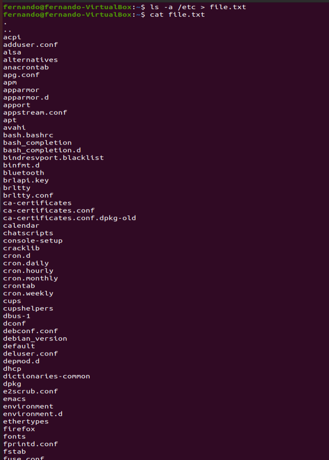{ #fig:001 width=70% }
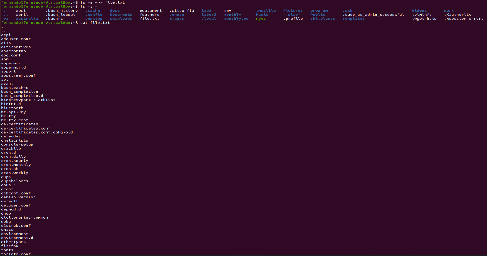{ #fig:002 width=70% }
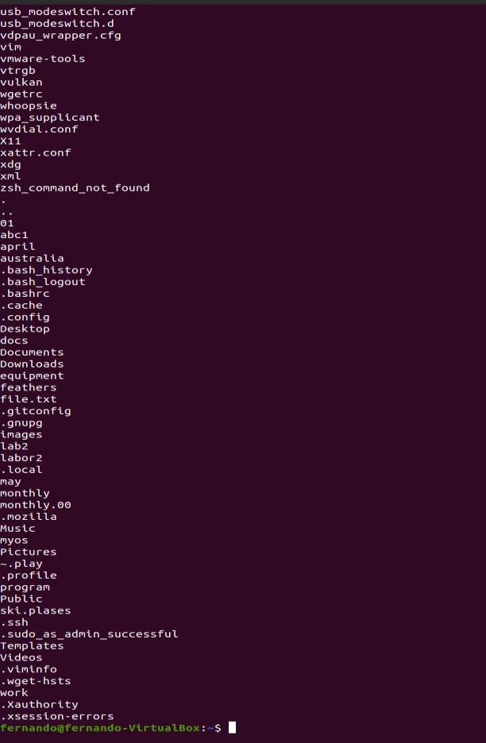{ #fig:003 width=70% }

3. Я имена всех файлов file.txt которые имеют расширение .conf и записать их в новый текстовый файл conf.txt с помощью команды 'grep-e'.conf$’ file.txt > conf.txt». "Кот conf.txt" проверяю правильность выполненных действий (рис . - @рис.004).

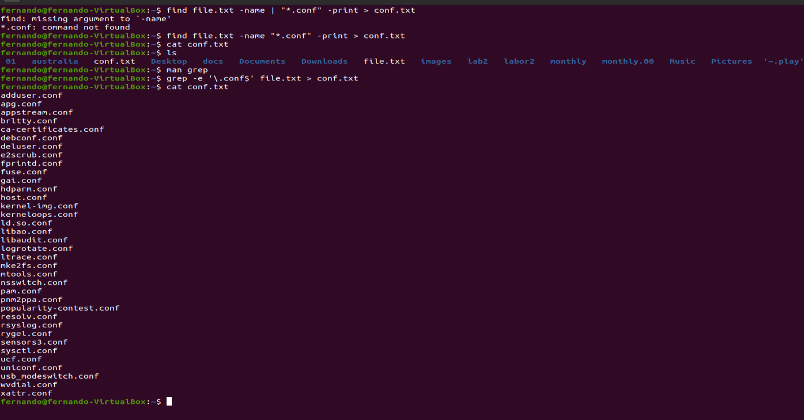{ #fig:004 width=70% }

4. Чтобы определить, какие файлы в моем домашнем каталоге имеют имена, начинающиеся с символа c, вы можете использовать несколько команд: "find ~ - maxdepth 1-name" c* "–print "(опция maxdepth 1 необходима, чтобы файлы находились только в домашнем каталоге (а не в его подкаталогах))," ls ~/C* "и" ls-а ~ | grep C* " (рис. - @рис.005).

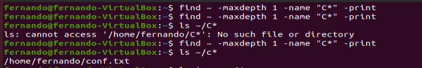{ #fig:005 width=70% }

5. Чтобы отобразить (страница за страницей) имена файлов каталога / etc, начинающиеся с символа h, используем команду " find | etc –maxdepth 1 –name "h*" / less" (рис. - @рис.006).

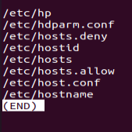{ #fig:006 width=70% }

6. Я запускаю фоновый процесс, который будет записывать в файл ~ / logfile файлы, имена которых начинаются с log, используя команду "find / - name" log * "> logfile & " (рис. - @рис.007). Команда "cat logfile" проверяет выполненные действия (рис. - @рис.008).
7. Удаляю файл ~/logfile командой «rm logfile».

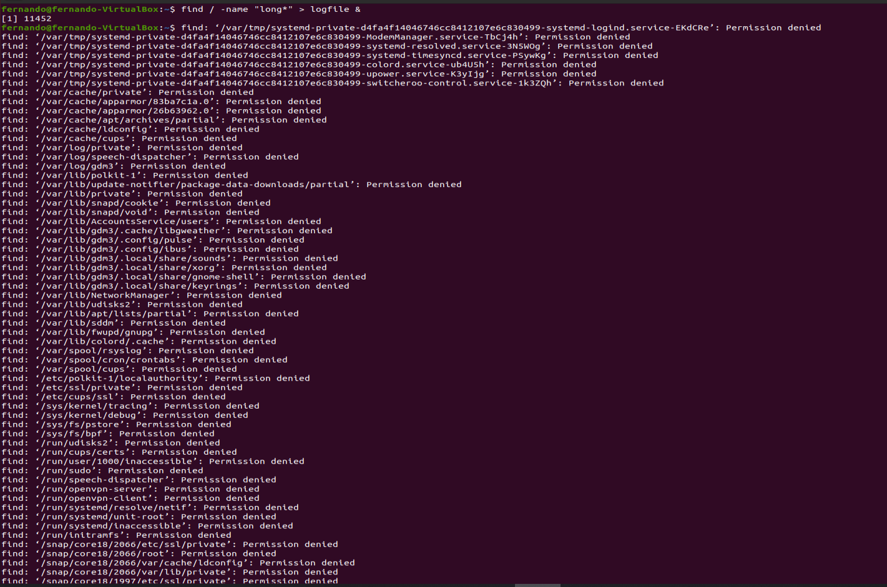{ #fig:007 width=70% }
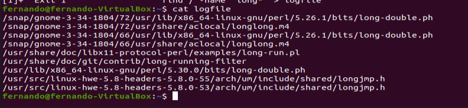{ #fig:008 width=70% }

8. я запускаю редактор gedit в фоновом режиме с помощью команды "gedit &" (рис. - @рис.009). После этого на экране появляется окно редактора.

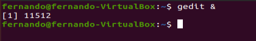{ #fig:009 width=70% }

9. Чтобы определить идентификатор процесса gedit, используйте команду "ps / grep-I "gedit"". Наш процесс имеет PID 518. Вы также можете узнать идентификатор процесса с помощью команды "pgrep gedit" или "pidof gedit" (рис. - @рис.010).

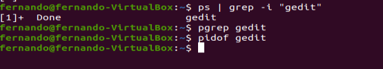{ #fig:009 width=70% }

10. Прочитав информацию из команды kill с помощью команды "man kill", я использую ее для завершения процесса gedit (команда" kill 518") (рис. - @рис.: 011) (рис. - @рис.012).

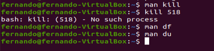{ #fig:0011 width=70% }
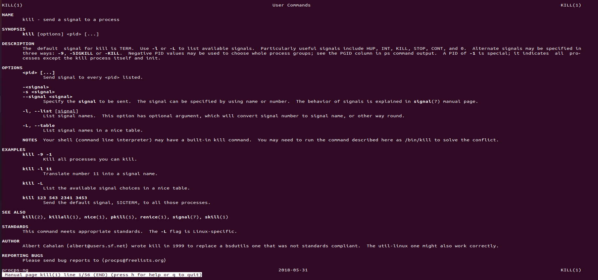{ #fig:0012 width=70% }

11. С помощью команд "man df" (рис. - @рис.: 013) и "man du" (рис. - @рис.: 014) я узнаю информацию о необходимых командах и использую их дальше (рис. - @рис.015).
df-это утилита, которая отображает список всех файловых систем по имени устройства, сообщает их размер, занимаемое и свободное пространство и точки монтирования.
Синтаксис: df параметры устройства
du-это утилита, предназначенная для отображения информации о том, сколько дискового пространства занимает файлы и каталоги. Он принимает путь к элементу файловой системы и отображает информацию о количестве байтов дискового пространства или дисковых блоков, используемых для его хранения.
Синтаксис: du параметры director_o_файл

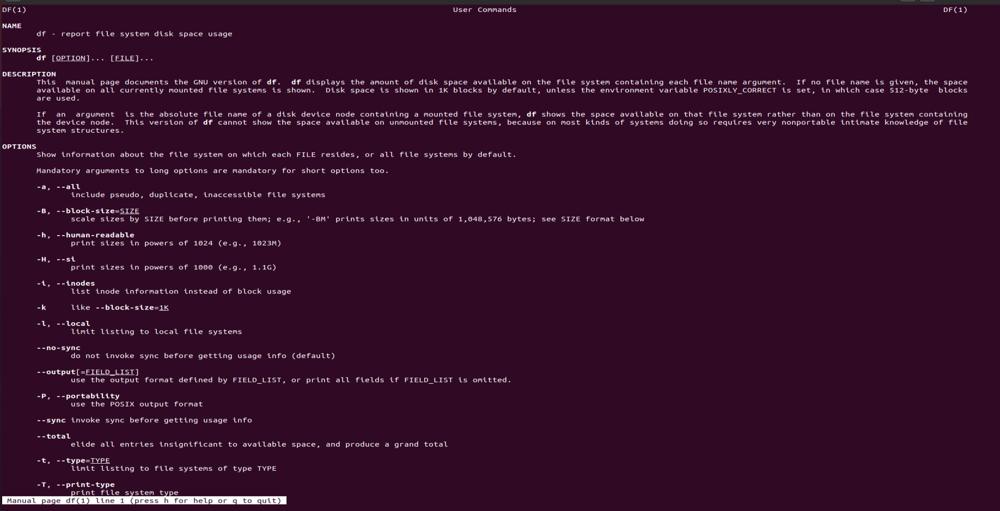{ #fig:0013 width=70% }
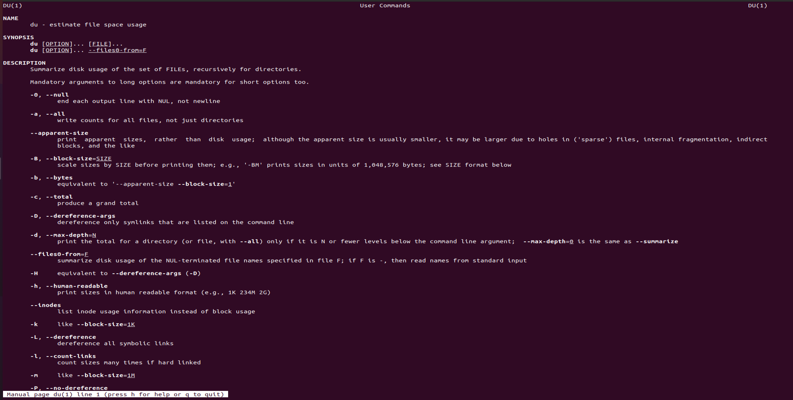{ #fig:0014 width=70% }
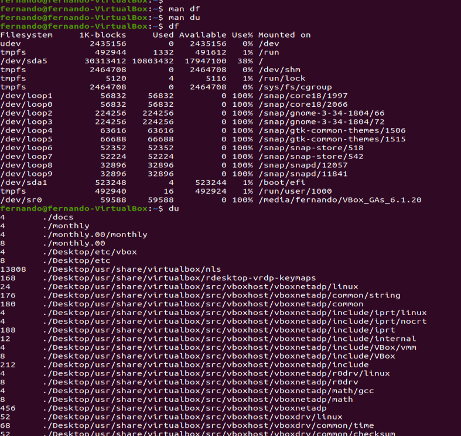{ #fig:0015 width=70% }

12. Мы получаем информацию с помощью команды " Man find "(рис. - @рис.: 016) и отображаем имена всех доступных каталогов в домашнем каталоге с помощью команды" find ~ -type d " (рис. - @рис.017).

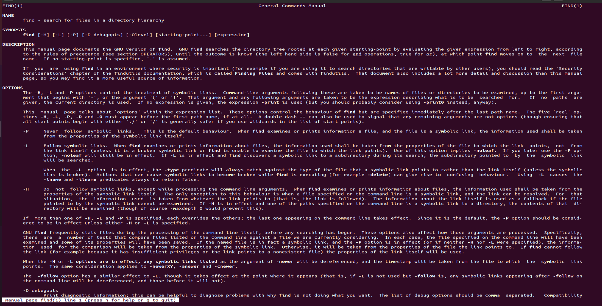{ #fig:0015 width=70% }
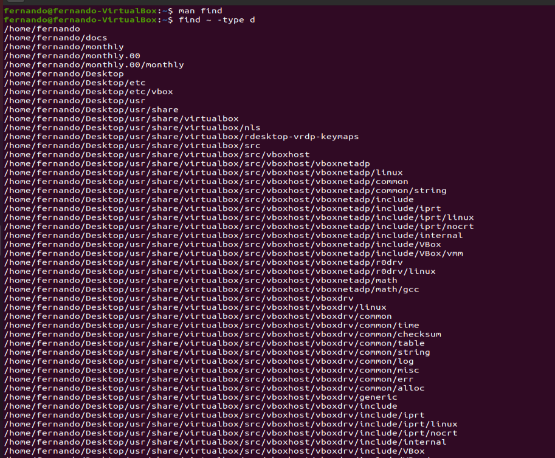{ #fig:0015 width=70% }

# Контрольные вопросы
1. В системе по умолчанию открыто три специальных потока:
stdin − стандартный поток ввода (по умолчанию: клавиатура), файловый дескриптор 0;
stdout − стандартный поток вывода (по умолчанию: консоль), файловый дескриптор 1;
stderr − стандартный поток вывод сообщений об ошибках (по умолчанию: консоль), файловый дескриптор 2. Большинство используемых в консоли команд и программ записывают результаты своей работы в стандартный поток вывода stdout.

2. ">" Перенаправление вывода в файл  
    ">>" Перенаправление вывода в файл и открытие файла в режиме добавления (данные добавляются в конец файла).
	
3. Конвейер (pipe) служит для объединения простых команд или утилит в цепочки, в которых результат работы предыдущей команды передаётся последующей.  
    Синтаксис следующий:  
    команда 1 | команда 2 (это означает, что вывод команды 1 передастся на ввод команде 2)
	
4. Процесс рассматривается операционной системой как заявка на потребление всех видов ресурсов, кроме одного − процессорного времени.  
    Этот последний важнейший ресурс распределяется операционной системой между другими единицами работы − потоками, которые и получили свое название благодаря тому, что они представляют собой последовательности (потоки выполнения) команд.  
    Процесс − это выполнение программы. Он считается активной сущностью и реализует действия, указанные в программе.  
    Программа представляет собой статический набор команд, а процесс - это набор ресурсов и данных, использующихся при выполнении программы.

5. pid: идентификатор процесса (PID) процесса (process ID), к которому вызывают метод  
    gid: идентификатор группы UNIX, в котором работает программа.
	
7. top − это консольная программа, которая показывает список работающих процессов в системе. Программа в реальном времени отсортирует запущенные процессы по их нагрузке на процессор.  
    htop − это продвинутый консольный мониторинг процессов. Утилита выводит постоянно меняющийся список системных процессов, который сортируется в зависимости от нагрузки на ЦПУ. Если делать сравнение с top, то htop показывает абсолютно все процессы в системе, время их непрерывного использования, загрузку процессоров и расход оперативной памяти.
	
8.  find − это команда для поиска файлов и каталогов на основе специальных условий. Ее можно использовать в различных обстоятельствах, например, для поиска файлов по разрешениям, владельцам, группам, типу, размеру и другим подобным критериям.  
    Команда find имеет такой синтаксис:  
    find папка параметры критерий шаблон действие  
    Папка − каталог в котором будем искать.  
    Параметры − дополнительные параметры, например, глубина поиска, и т.д.  
    Критерий − по какому критерию будем искать: имя, дата создания, права, владелец и т.д.  
    Шаблон – непосредственно значение по которому будем отбирать файлы.  
    Основные параметры:

-   \-P никогда не открывать символические ссылки
-   \-L - получает информацию о файлах по символическим ссылкам. Важно для дальнейшей обработки, чтобы обрабатывалась не ссылка, а сам файл
-   \-maxdepth - максимальная глубина поиска по подкаталогам, для поиска только в текущем каталоге установите 1
-   \-depth - искать сначала в текущем каталоге, а потом в подкаталогах
-   \-mount искать файлы только в этой файловой системе
-   \-version - показать версию утилиты find
-   \-print - выводить полные имена файлов
-   \-type f - искать только файлы
-   \-type d - поиск папки в Linux  
    Основные критерии:
-   \-name - поиск файлов по имени
-   \-perm - поиск файлов в Linux по режиму доступа
-   \-user - поиск файлов по владельцу
-   \-group - поиск по группе
-   \-mtime - поиск по времени модификации файла
-   \-atime - поиск файлов по дате последнего чтения
-   \-nogroup - поиск файлов, не принадлежащих ни одной группе
-   \-nouser - поиск файлов без владельцев
-   \-newer - найти файлы новее чем указанный
-   \-size - поиск файлов в Linux по их размеру  
    Примеры:  
    find ~ -type d поиск директорий в домашнем каталоге  
    find ~ -type f -name ".\*" поиск скрытых файлов в домашнем каталоге
	
9. Файл по его содержимому можно найти с помощью команды grep: «grep -r "слово/выражение, которое нужно найти"».

10. Утилита df, позволяет проанализировать свободное пространство на всех подключенных к системе разделах.

11. При выполнении команды du (без указания папки и опции) можно получить все файлы и папки текущей директории с их размерами. Для домашнего каталога: du ~/

12. Основные сигналы (каждый сигнал имеет свой номер), которые используются для завершения процесса:

-   SIGINT – самый безобидный сигнал завершения, означает Interrupt. Он отправляется процессу, запущенному из терминала с помощью сочетания клавиш Ctrl+C. Процесс правильно завершает все свои действия и возвращает управление;
-   SIGQUIT – это еще один сигнал, который отправляется с помощью сочетания клавиш, программе, запущенной в терминале. Он сообщает ей, что нужно завершиться и программа может выполнить корректное завершение или проигнорировать сигнал. В отличие от предыдущего, она генерирует дамп памяти. Сочетание клавиш Ctrl+/;
-   SIGHUP – сообщает процессу, что соединение с управляющим терминалом разорвано, отправляется, в основном, системой при разрыве соединения с интернетом;
-   SIGTERM – немедленно завершает процесс, но обрабатывается программой, поэтому позволяет ей завершить дочерние процессы и освободить все ресурсы;
-   SIGKILL – тоже немедленно завершает процесс, но, в отличие от предыдущего варианта, он не передается самому процессу, а обрабатывается ядром. Поэтому ресурсы и дочерние процессы остаются запущенными.  
    Также для передачи сигналов процессам в Linux используется утилита kill, её синтаксис: kill -сигнал pid\_процесса (PID – уникальный идентификатор процесса). Сигнал представляет собой один из выше перечисленных сигналов для завершения процесса.  
    Перед тем, как выполнить остановку процесса, нужно определить его PID. Для этого используют команды ps и grep. Команда ps предназначена для вывода списка активных процессов в системе и информации о них. Команда grep запускается одновременно с ps (в канале) и будет выполнять поиск по результатам команды ps.  
    Утилита pkill – это оболочка для kill, она ведет себя точно так же, и имеет тот же синтаксис, только в качестве идентификатора процесса ей нужно передать его имя.  
    killall работает аналогично двум предыдущим утилитам. Она тоже принимает имя процесса в качестве параметра и ищет его PID в директории /proc. Но эта утилита обнаружит все процессы с таким именем и завершит их.
# Выводы

Во время этой лабораторной работы я изучил инструменты поиска файлов и фильтрации текстовых данных, такие как практические навыки: управление процессами (и задания), проверка использования диска и обслуживание файловой системы.
