---
# Front matter
lang: ru-RU
title: "Шаблон отчёта по лабораторной работе 8"
subtitle: "дисциплина: Операционные системы"
author: "Студент: Леон Атупанья Хосе Фернандо"

# Formatting
toc-title: "Содержание"
toc: true # Table of contents
toc_depth: 2
lof: true # List of figures
lot: true # List of tables
fontsize: 12pt
linestretch: 1.5
papersize: a4paper
documentclass: scrreprt
polyglossia-lang: russian
polyglossia-otherlangs: english
mainfont: PT Serif
romanfont: PT Serif
sansfont: PT Sans
monofont: PT Mono
mainfontoptions: Ligatures=TeX
romanfontoptions: Ligatures=TeX
sansfontoptions: Ligatures=TeX,Scale=MatchLowercase
monofontoptions: Scale=MatchLowercase
indent: true
pdf-engine: lualatex
header-includes:
  - \linepenalty=10 # the penalty added to the badness of each line within a paragraph (no associated penalty node) Increasing the value makes tex try to have fewer lines in the paragraph.
  - \interlinepenalty=0 # value of the penalty (node) added after each line of a paragraph.
  - \hyphenpenalty=50 # the penalty for line breaking at an automatically inserted hyphen
  - \exhyphenpenalty=50 # the penalty for line breaking at an explicit hyphen
  - \binoppenalty=700 # the penalty for breaking a line at a binary operator
  - \relpenalty=500 # the penalty for breaking a line at a relation
  - \clubpenalty=150 # extra penalty for breaking after first line of a paragraph
  - \widowpenalty=150 # extra penalty for breaking before last line of a paragraph
  - \displaywidowpenalty=50 # extra penalty for breaking before last line before a display math
  - \brokenpenalty=100 # extra penalty for page breaking after a hyphenated line
  - \predisplaypenalty=10000 # penalty for breaking before a display
  - \postdisplaypenalty=0 # penalty for breaking after a display
  - \floatingpenalty = 20000 # penalty for splitting an insertion (can only be split footnote in standard LaTeX)
  - \raggedbottom # or \flushbottom
  - \usepackage{float} # keep figures where there are in the text
  - \floatplacement{figure}{H} # keep figures where there are in the text
---

## РОССИЙСКИЙ УНИВЕРСИТЕТ ДРУЖБЫ НАРОДОВ
## Факультет физико-математических и естественных наук 
### Кафедра прикладной информатики и теории вероятностей

### ОТЧЕТ ПО ЛАБОРАТОРНОЙ РАБОТЕ № 8

*дисциплина: Операционные системы*

**Студент: Хосе Фернадо Леон Атупанья** 
**Группа: НПМбд-02-20**

МОСКВА 2021 г.

# Цель работы

Освоение основных возможностей командной оболочки
Midnight Commander. Приобретение навыков практической работы по просмотру каталогов и файлов; манипуляций с ними.

# Задание по mc 

1. Изучите информацию о mc, вызвав в командной строке man mc.
2. Запустите из командной строки mc, изучите его структуру и меню.
3. Выполните несколько операций в mc, используя управляющие клавиши
(операции с панелями; выделение/отмена выделения файлов, копирование/перемещение файлов, получение информации о размере и правах доступа
на файлы и/или каталоги и т.п.)
4. Выполните основные команды меню левой (или правой) панели. Оцените степень подробности вывода информации о файлах.
5. Используя возможности подменю Файл , выполните:
– просмотр содержимого текстового файла;
– редактирование содержимого текстового файла (без сохранения результатов
редактирования);
– создание каталога;
– копирование в файлов в созданный каталог.
6. С помощью соответствующих средств подменю Команда осуществите:
– поиск в файловой системе файла с заданными условиями (например, файла
с расширением .c или .cpp, содержащего строку main);
– выбор и повторение одной из предыдущих команд;
– переход в домашний каталог;
– анализ файла меню и файла расширений.
7. Вызовите подменю Настройки . Освойте операции, определяющие структуру
экрана mc (Full screen, Double Width, Show Hidden Files и т.д.)

# Задание по встроенному редактору mc

1. Crea un archivo de texto.txt.
2. Abra este archivo con el Editor integrado en mc.
Kulyabov D. S. y otros sistemas Operativos 39
3. Pegue un pequeño fragmento de texto copiado de cualquier otro archivo o Internet en el archivo abierto.
4. Realice las siguientes manipulaciones con el texto utilizando las teclas de acceso rápido:
4.1. Elimine una línea de texto.
4.2. Seleccione un fragmento de texto y cópielo en una nueva línea.
4.3. Seleccione un fragmento de texto y muévalo a una nueva línea.
4.4. Guarde el archivo.
4.5. Cancele la Última acción.
4.6. Vaya al final del archivo (presionando la combinación de teclas) y escriba algo de texto.
4.7. Vaya al principio del archivo (presionando la combinación de teclas) y escriba algo de texto.
4.8. Guarde y cierre el archivo.
5. Abra el archivo con el texto original en algún lenguaje de programación (por ejemplo, C o Java)
6. Usando el menú del Editor, Active el resaltado de sintaxis si no está habilitado o apáguelo si está habilitado.

# Выполнение лабораторной работы
Задание 1:

Изучим информацию о mc, вызвав в командной строке «man mc» Midnight Commander 

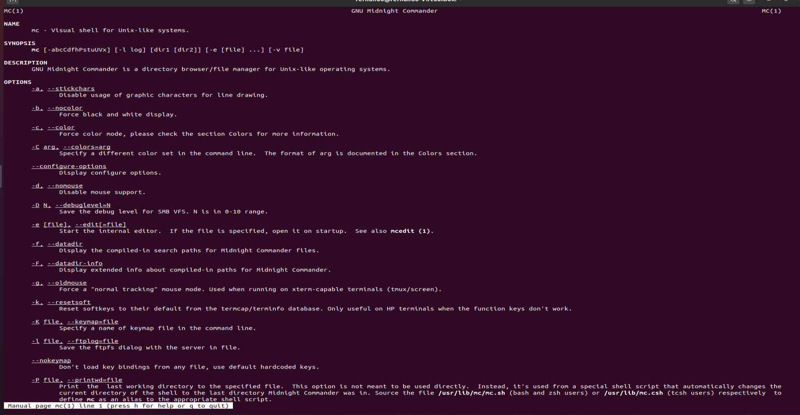{ #fig:001 width=70% }

2. Запустим из командной строки mc и изучим его структуру и меню

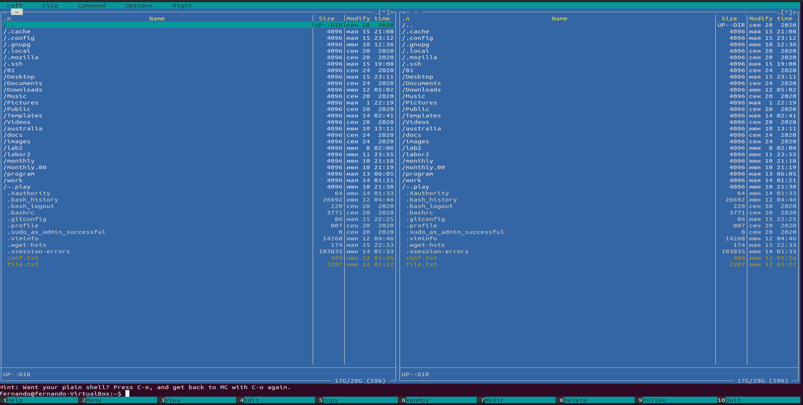{ #fig:002 width=70% }

3. Выполните несколько операций в mc, используя управляющие клавиши (операции с панелями; выделение/отмена выделения файлов, копирование/перемещение файлов, получение информации о размере и правах доступа на файлы и/или каталоги и т.п.)

- Для выделения файлов или его отмены можно использовать пункты «Отметить группу», «Снять отметку», «Обратить выделение» в меню «Файл»

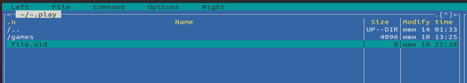{ #fig:003 width=70% }

- Копирование/перемещение файлов Для копирования файла используются клавиши «fn»+«F5»

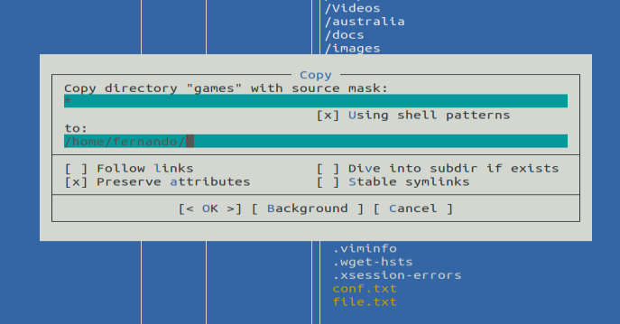{ #fig:004 width=70% }

- Для перемещения файла используются клавиши «fn»+«F6»

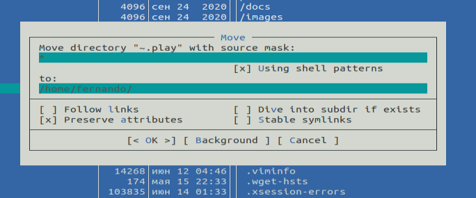{ #fig:005 width=70% }

- Получение информации о размере и правах доступа на файлы
и/или каталоги. Для получения данной информации можно перейти в пункты:
«Левая панель» → «Информация»

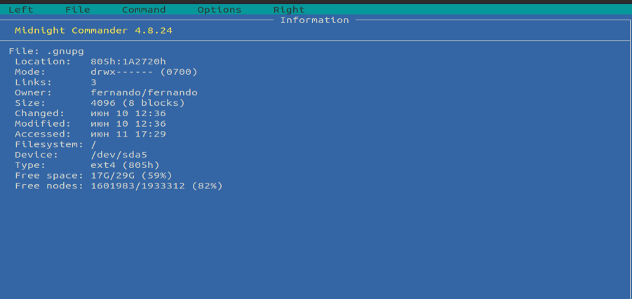{ #fig:006 width=70% }

- «Файл» → «Права доступа»\

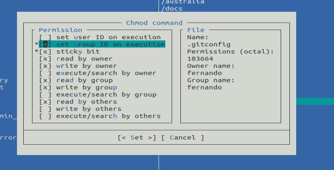{ #fig:007 width=70% }

4. Выполним основные команды меню правой панели

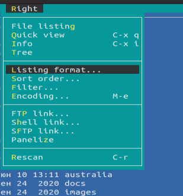{ #fig:008 width=70% }
- Пункт «Список файлов» отображает размер файла и время его правки

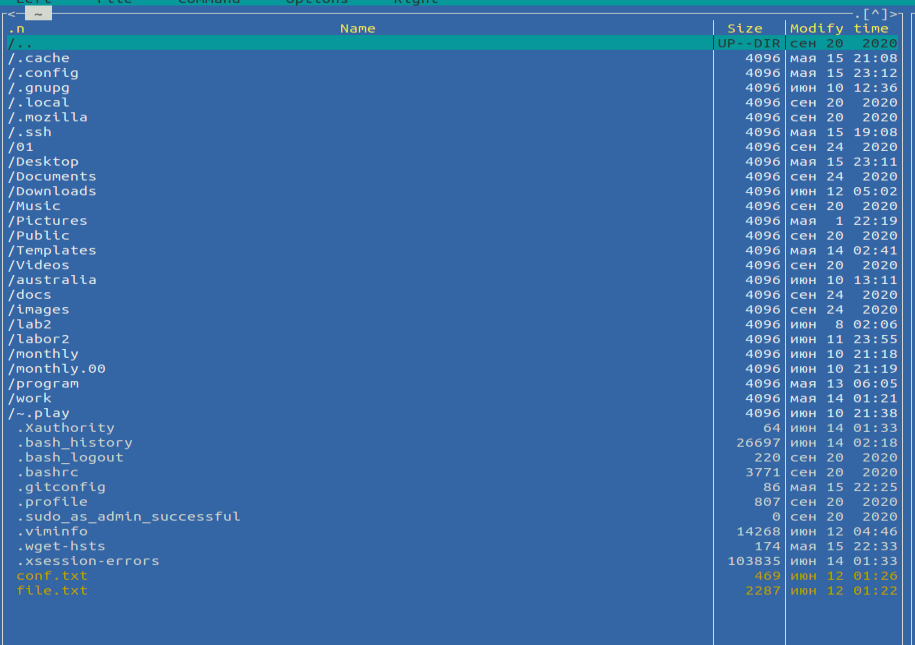{ #fig:009 width=70% }
- Пункт «Быстрый просмотр» необходим для предпросмотра содержания файла

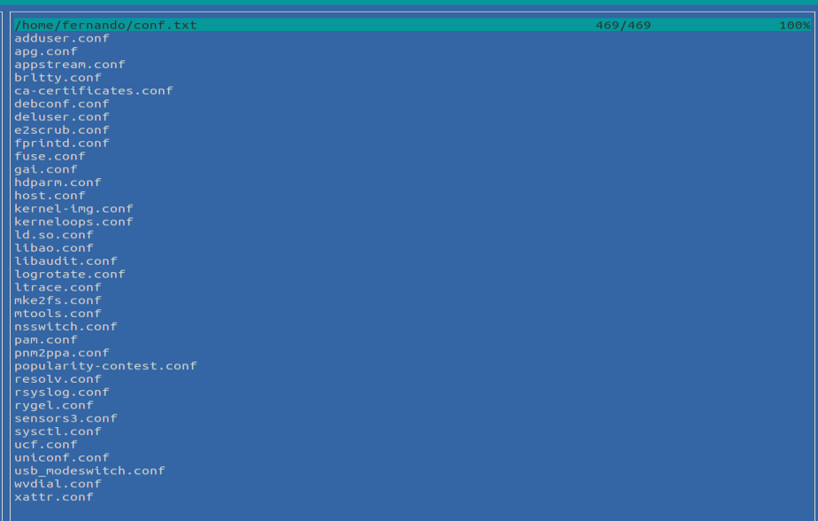{ #fig:0010 width=70% }
- Пункт «Дерево» необходим для просмотра дерева каталога (отображает минимум информации)

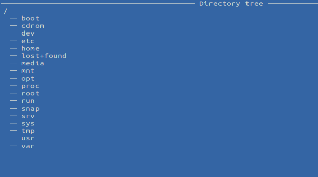{ #fig:0011 width=70% }
- Пункт «Фильтр» необходим, чтобы просматривать название файлов или каталогов, которые подходят под указанную маску

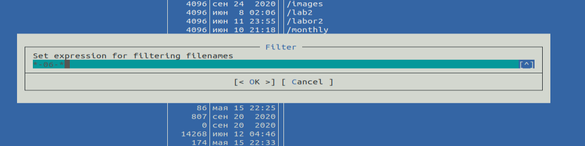{ #fig:0012 width=70% }

5.  Используя возможности подменю «Файл», выполним:

- Просмотр содержимого текстового файла
Выберем текстовый файл и перейдем в пункт «Просмотр»

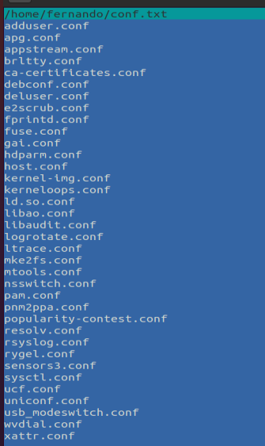{ #fig:0013 width=70% }

- Редактирование содержимого текстового файла (без сохранения результатов редактирования)
Перейдем в пункт «Правка» и изменим первое слово «adduser» на «abcd

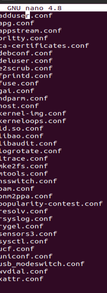{ #fig:0014 width=70% }
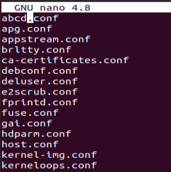{ #fig:0015 width=70% }

- Создание каталога
Перейдем в пункт «Создание каталога» и создадим каталог abcd

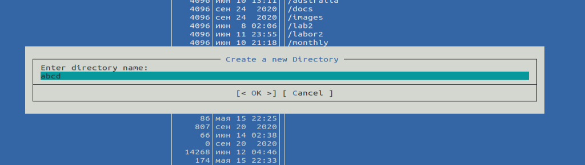{ #fig:0016 width=70% }

- Копирование файлов в созданный каталог. Для этого, используя клавишу «ins», выделим несколько файлов

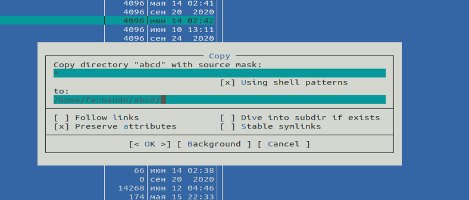{ #fig:0017 width=70% }

6. С помощью соответствующих средств подменю Команда осуществите:
- Поиск в файловой системе файла с заданными условиями
Перейдем в пункт «Поиск файла» и зададим следующие
параметры: «От каталога» /, «Шаблон имени» *.с,
«Содержимое» main и дождемся окончания
поиска

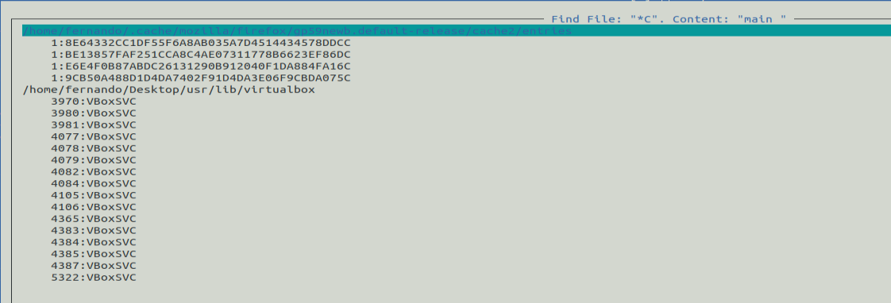{ #fig:0018 width=70% }

- Аналогичным образом найдем файлы с шаблоном имени \*.cpp

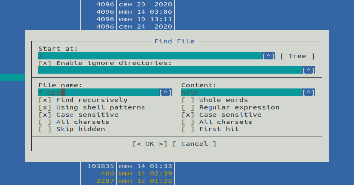{ #fig:0019 width=70% }

- Выбор и повторение одной из предыдущих команд. Перейдем в пункт «История командной строки» и увидим, что внизу экрана появилась сноска «История», но т.к. командная строка не была использована эта сноска пустая.

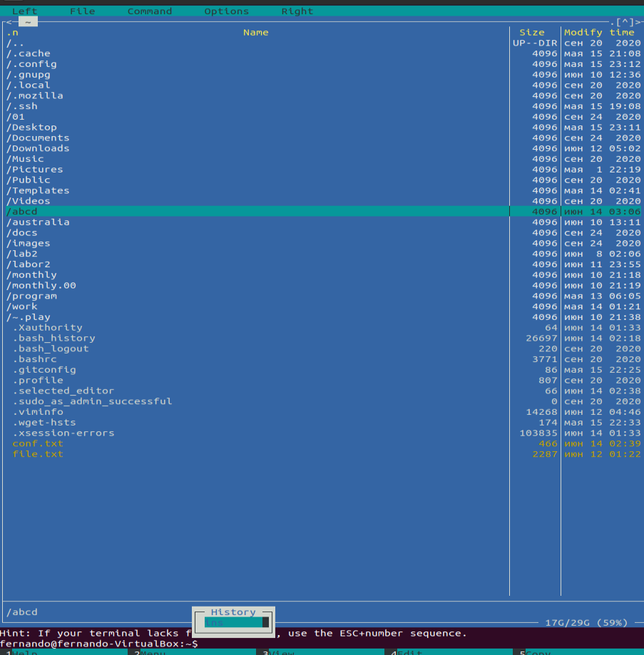{ #fig:0020 width=70% }

- переход в домашний каталог
Для перехода в домашний каталог перейдем в пункт «Дерево
каталогов», выберем необходимый каталог и
нажмем «enter», в результате чего, в левой панели перейдем в
домашний каталог

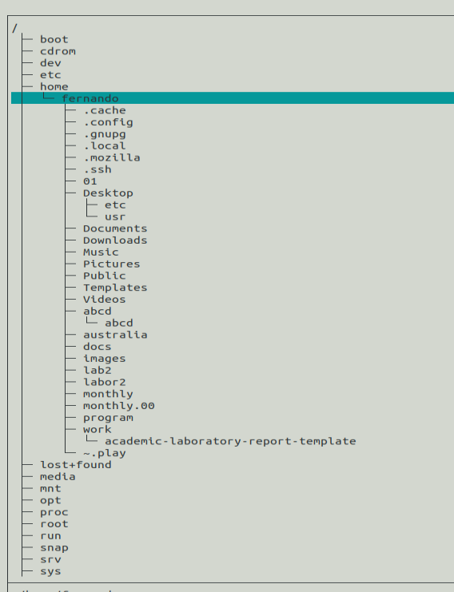{ #fig:0021 width=70% }

- Анализ файла меню и файла расширений
Редактировать файл расширений − позволяет задать с помощью определённого синтаксиса действия при запуске файлов с определённым расширением (например, какое программное
обеспечение запускать для открытия или редактирования файлов с расширением doc или docx). Пункт «Редактировать файл меню» − позволяет отредактировать контекстное меню пользователя

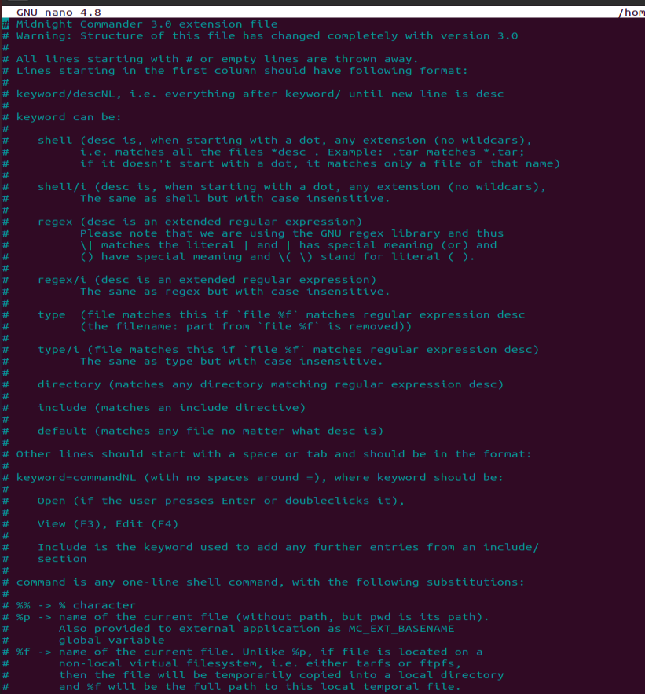{ #fig:0022 width=70% }

7. Вызовем подменю «Настройки». Освоим операции, определяющие структуру экрана mc:

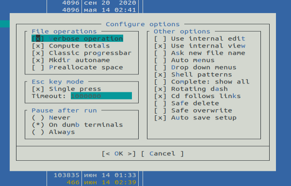{ #fig:0023 width=70% }

Задание 2:

1.  С помощью команды «touch text.txt» создаем текстовой файл text.txt. Командой «ls» проверяем правильность выполненных действий. Открываем этот файл с помощью встроенного mc редактора командой «mcedit text.txt»

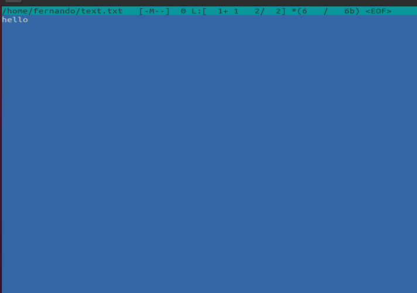{ #fig:0024 width=70% }

2. См. пункт выше
3.  Вставим в открытый файл небольшой фрагмент текста, скопированный из Интернета

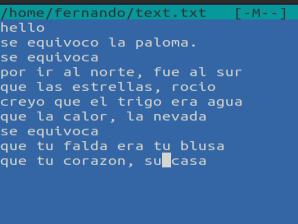{ #fig:0025 width=70% }
4. 
- Удалим 6-ю строку текста с помощью клавиш «fn»+«F8»

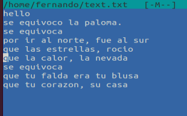{ #fig:0026 width=70% }

- Выделим фрагмент текста, нажав «fn»+«F3» для начала выделения текста и для его окончания, и скопируем его на
новую строку, используя клавиши «fn»+«F5»

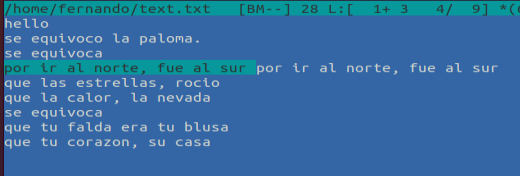{ #fig:0027 width=70% }

- Выделим фрагмент текста и перенесем его на новую строку с помощью клавиш «fn»+«F6»

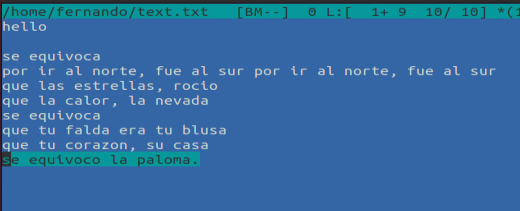{ #fig:0028 width=70% }

- Сохраним файл, нажав «fn»+«F2»
- Отменим последнее действие с помощью клавиш «ctrl»+«u»
 - Перейдем в конец файла, нажав клавиши «ctrl»+«end» (переход в конец файла) и «ctrl»+«x» (переход в конец следующего слова) и напишем следующий текст "Fernando Leon"

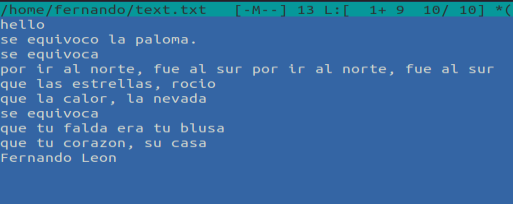{ #fig:0029 width=70% }

- Перейдем в начало файла, нажав клавиши «ctrl»+«home» (переход в начало файла) и «ctrl»+«z» (переход в начало следующего слова) и напишем следующий текст «Para: Mi familia: »

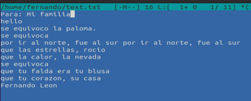{ #fig:0030 width=70% }

# Контрольные вопросы
1) Панели могут дополнительно быть переведены в один из двух
режимов: «Информация» или «Дерево». В режиме «Информация» на
панель выводятся сведения о файле и текущей файловой системе,
расположенных на активной панели. В режиме «Дерево» на одной из
панелей выводится структура дерева каталогов.
2) Как с помощью команд shell, так и с помощью меню (комбинаций
клавиш) mc можно выполнить следующие операции с файлами:
 копирование «F5» («cp имя_файла имя_каталога(в который
копируем)») (Рисунок 14)
 перемещение/переименование «F6» («mv имя_файла
имя_каталога(в который перемещаем)») (Рисунок 15)
 создание каталога «F7» («mkdir имя_каталога») (Рисунок 38)
 удаление «F8» («rm имя_файла»)
 изменение прав доступа «ctrl+x» («chmod u+x имя_файла»)
3) Перейти в строку меню панелей mc можно с помощью
функциональной клавиши «F9». В строке меню имеются пять меню:
«Левая панель», «Файл», «Команда», «Настройки» и «Правая
панель».
Подпункт меню «Быстрый просмотр» позволяет выполнить быстрый
просмотр содержимого панели.
Подпункт меню «Информация» позволяет посмотреть информацию о
файле или каталоге.
В меню каждой (левой или правой) панели можно выбрать «Формат
списка»:
 стандартный − выводит список файлов и каталогов с указанием
размера и времени правки;
 ускоренный − позволяет задать число столбцов, на которые
разбивается панель при выводе списка имён файлов или
каталогов без дополнительной информации;
 расширенный − помимо названия файла или каталога выводит
сведения о правах доступа, владельце, группе, размере,
времени правки;
 определённый пользователем − позволяет вывести те сведения
о файле или каталоге, которые задаст сам пользователь.
Подпункт меню «Порядок сортировки» позволяет задать критерии
сортировки при выводе списка файлов и каталогов: без сортировки,
по имени, расширенный, время правки, время доступа, время
изменения атрибута, размер, узел.
4) Команды меню «Файл»:
 Просмотр («F3») − позволяет посмотреть содержимое текущего
(или выделенного) файла без возможности редактирования.
 Просмотр вывода команды («М» + «!») − функция запроса
команды с параметрами (аргумент к текущему выбранному
файлу).
 Правка («F4») − открывает текущий (или выделенный) файл
для его редактирования.
 Копирование («F5») − осуществляет копирование одного или
нескольких файлов или каталогов в указанное пользователем во
всплывающем окне место.
 Права доступа («Ctrl-x» «c») − позволяет указать (изменить)
права доступа к одному или нескольким файлам или каталогам.
 Жёсткая ссылка («Ctrl-x» «l») − позволяет создать жёсткую
ссылку к текущему (или выделенному) файлу.
 Символическая ссылка («Ctrl-x» «s») − позволяет создать
символическую ссылку к текущему (или выделенному) файлу.
 Владелец/группа («Ctrl-x» «o») − позволяет задать (изменить)
владельца и имя группы для одного или нескольких файлов или
каталогов.
 Права (расширенные) − позволяет изменить права доступа и
владения для одного или нескольких файлов или каталогов.
 Переименование («F6») − позволяет переименовать (или
переместить) один или несколько файлов или каталогов.
 Создание каталога («F7») − позволяет создать каталог.
 Удалить («F8») − позволяет удалить один или несколько файлов
или каталогов.
 Выход («F10») − завершает работу mc.
5) Меню Команда
В меню Команда содержатся более общие команды для работы с mc.
Команды меню Команда:
 Дерево каталогов − отображает структуру каталогов системы.
 Поиск файла − выполняет поиск файлов по заданным
параметрам.
 Переставить панели − меняет местами левую и правую панели.
 Сравнить каталоги («Ctrl-x» «d») − сравнивает содержимое
двух каталогов.
 Размеры каталогов − отображает размер и время изменения
каталога (по умолчанию в mc размер каталога корректно не
отображается).
 История командной строки − выводит на экран список ранее
выполненных в оболочке команд.
 Каталоги быстрого доступа ( Ctrl-\») − при вызове выполняется
быстрая смена текущего каталога на один из заданного списка.
 Восстановление файлов − позволяет восстановить файлы на
файловых системах ext2 и ext3.
 Редактировать файл расширений − позволяет задать с помощью
определённого синтаксиса действия при запуске файлов с
определённым расширением (например, какое программного
обеспечение запускать для открытия или редактирования
файлов с расширением doc или docx).
 Редактировать файл меню − позволяет отредактировать
контекстное меню пользователя, вызываемое по клавише «F2».
 Редактировать файл расцветки имён − позволяет подобрать
оптимальную для пользователя расцветку имён файлов в
зависимости от их типа.
6) Меню Настройки содержит ряд дополнительных опций по внешнему
виду и функциональности mc.
Меню Настройки содержит:
 Конфигурация − позволяет скорректировать настройки работы
с панелями.
 Внешний вид и Настройки панелей − определяет элементы
(строка меню, командная строка, подсказки и прочее),
отображаемые при вызове mc, а также геометрию
расположения панелей и цветовыделение.
 Биты символов − задаёт формат обработки информации
локальным терминалом.
 Подтверждение − позволяет установить или убрать вывод окна
с запросом подтверждения действий при операциях удаления и
перезаписи файлов, а также при выходе из программы.
 Распознание клавиш − диалоговое окно используется для
тестирования функциональных клавиш, клавиш управления
курсором и прочее.
 Виртуальные ФС − настройки виртуальной файловой системы:
тайм-аут, пароль и прочее.
7) Функциональные клавиши mc:
 F1 – вызов контекстно-зависимой подсказки
 F2 – вызов пользовательского меню с возможностью создания
и/или дополнения дополнительных функций
 F3 – просмотр содержимого файла, на который указывает
подсветка в активной панели (без возможности
редактирования)
 F4 – вызов встроенного в mc редактора для изменения
содержания файла, на который указывает подсветка в активной
панели
 F5 – копирование одного или нескольких файлов, отмеченных
в первой (активной) панели, в каталог, отображаемый на второй
панели
 F6 – перенос одного или нескольких файлов, отмеченных в
первой (активной) панели, в каталог, отображаемый на второй
панели
 F7 – создание подкаталога в каталоге, отображаемом в активной
панели
 F8 – удаление одного или нескольких файлов (каталогов),
отмеченных в первой (активной) панели файлов
 F9 – вызов меню mc
 F10 – выход из mc
8) Встроенный в mc редактор вызывается с помощью функциональной
клавиши «F4». В нём удобно использовать различные комбинации
клавиш при редактировании содержимого (как правило текстового)
файла.
Клавиши для редактирования файла:
 «Ctrl-y» − удалить строку
 «Ctrl-u» − отмена последней операции
 «ins» вставка/замена
 «F7» − поиск (можно использовать регулярные выражения)
 «↑-F7» − повтор последней операции поиска
 «F4» − замена
 «F3» − первое нажатие − начало выделения, второе − окончание
выделения
 «F5» − копировать выделенный фрагмент
 «F6» − переместить выделенный фрагмент
 «F8» − удалить выделенный фрагмент
 «F2» − записать изменения в файл
 «F10» − выйти из редактор
9) Для редактирования меню пользователя, которое вызывается
клавишей «F2», необходимо перейти в пункт «Редактировать файл
меню» → «Команда» и изменить настройки файла.
10) Часть команд «Меню пользователя», а также меню «Файл»
позволяют выполнять действия, определяемые пользователем, над
текущим файлом. Например, копирование каталога или файла,
переименование, перемещение, архивирование.
# Выводы

В ходе этой лабораторной работы я освоил основные
функции Midnight Commander Commander и
приобрел практические навыки в обзоре каталогов и
файлов; манипулирование ими
